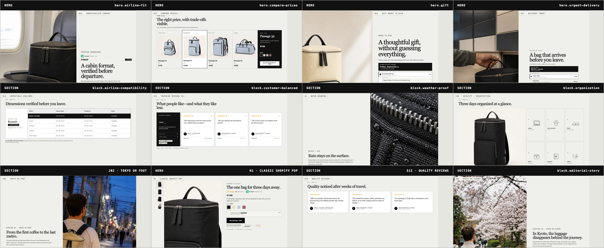
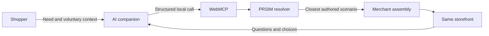

# PRSIM

**Minimum information. Maximum relevance.**

PRSIM is a WebMCP commerce prototype that lets a shopper describe what they need in natural language and turns the current storefront into the closest merchant-authored buying experience.

[Live demo](https://prsim.yafa.sh/#preview) · [WebMCP Challenge](https://openai.com/webmcp-challenge/) · [WebMCP documentation](https://learn.chatgpt.com/docs/webmcp)



## The problem

Most product pages are exhaustive by default. They present every feature, proof point, review, use case and promotion, then leave the shopper to find the few details that matter for the decision at hand.

A first-time Ryanair passenger with a strict budget does not need the same page as a business traveller taking the Eurostar, a cyclist choosing a daily bag, or someone buying a birthday gift.

Conventional personalisation often relies on hidden behavioural tracking. PRSIM starts somewhere more explicit: the shopper tells their own AI companion what matters for this purchase. The website receives only the useful purchase context and responds with an experience assembled from components approved by the merchant.

## What PRSIM does

The initial WebMCP entry point accepts a need rather than UI instructions:

```text
“I’m flying to Dublin with Ryanair for three days. My budget is €100,
I want the black bag, and fitting under the seat matters most.”
```

In one call, PRSIM:

1. interprets explicit context, constraints and decision preferences;
2. finds the closest authored scenario;
3. selects the product and preselects a colorway;
4. resolves an assembly of layouts, copy, imagery and evidence;
5. updates the storefront in place;
6. returns one concise recommendation to the companion.

The assistant does not invent a page. It selects and adjusts a bounded system of merchant-authored layouts, blocks, copy, assets and product facts.

After the initial experience is ready, the broad entry tool disappears. Focused tools can then answer a question or change one part of the page without rebuilding the entire experience.

## Human and agent roles



The shopper can always change color, ask for proof, compare formats, inspect policy information, reset the experience or proceed to checkout. Final payment still requires buyer confirmation.

## Explore the prototype

You can inspect PRSIM without an AI companion. Start with the [scenario selector](https://prsim.yafa.sh/#scenarios), then open a prepared storefront directly:

- [Lucia — visual long-haul travel](https://prsim.yafa.sh/s4#preview)
- [Kevin — collect or receive today](https://prsim.yafa.sh/s15#preview)
- [Ryan — Ryanair cabin fit](https://prsim.yafa.sh/s1#preview)
- [Paul — analytical product proof](https://prsim.yafa.sh/s11#preview)
- [Sophie — gift, personalisation and delivery](https://prsim.yafa.sh/s2#preview)

For the companion flow, open the [WebMCP Preview](https://prsim.yafa.sh/#preview) in a supported browser. The merchant studio is also available in the live prototype:

- [Brand](https://prsim.yafa.sh/#brand) — name, palette, typography and trust cues.
- [Layouts](https://prsim.yafa.sh/#library) — the reusable page vocabulary.
- [Assets](https://prsim.yafa.sh/#assets) — product views, swatches and contextual photography.
- [Blocks](https://prsim.yafa.sh/#blocks) — reusable proof, review, delivery and product-content units.
- [Assemblies](https://prsim.yafa.sh/#assemblies) — ordered layout instances bound to approved copy, assets and evidence.
- [Foundation](https://prsim.yafa.sh/#foundation) — the relevance-first rationale behind the system.

## Fair demo setup

The repository includes one optional [`demo-companion/AGENTS.md`](demo-companion/AGENTS.md). Its only purpose is to remind a browser companion to inspect Website Tools on the active page. It contains no PRSIM-specific tool names, shopper profile, destination, budget, preference, scenario mapping, expected call, or scripted response.

All useful shopping context must be written by the shopper in the visible conversation. The repository does not include persona-specific agent instructions. Portraits under `demo-companion/personas/` are presentation assets only and are never loaded as user context.

## Merchant-controlled content model

PRSIM separates reusable concerns instead of storing each page as one large template:

- **Brand:** name, palette, title typography and trust colors.
- **Layouts:** reusable visual structures with editable props and content slots.
- **Blocks:** purpose-based content units, such as airline compatibility, material proof, delivery or reviews.
- **Assets:** product views, material swatches, contextual photography, editorial imagery, icons and sketches.
- **Customer evidence:** reviews, comments and testimonials with a declared source, rating, verification status and prototype disclosure.
- **Assemblies:** ordered layout instances bound to copy, assets and evidence.
- **Variants:** patches that can change props, assets, content, order or presence without duplicating the entire assembly.
- **Scenarios:** contextual signatures connected to an authored assembly and used as neighbours during matching.

The current prototype contains:

- 21 authored scenario seeds;
- 4 products in the Passage family, from 24 L to 42 L;
- 4 selectable colorways: black, cream, Liberty blue and Liberty burgundy;
- 198 registered visual assets;
- reusable hero, argument, proof, reassurance and CTA layouts;
- a combinatorial scenario vocabulary spanning context, buying situation, decision style, projection, content preference, tone, age band, requested representation, color and language.

The full combinatorial space is intentionally not hand-authored. PRSIM finds the nearest useful scenario, then applies smaller local variations. Future merchant analytics could show unmet demand clusters and help teams author the next scenarios with the highest value.

### A tailoring workflow, not infinite page generation

A merchant starts with a product truth, a brand and a small set of reusable layouts. From there, the system can be enriched gradually: add new product or contextual photos, connect approved customer-review sources, bind evidence to the relevant blocks, compose an assembly and author the next missing scenario when demand appears in analytics.

The prototype demonstrates this governed content model through local registries and bindings. A production version would connect the same model to a merchant's asset library, catalogue, review provider and analytics stack. The goal is not to make thousands of pages by hand; it is to tailor a finite, approved vocabulary to the shopper's expressed need.

## WebMCP tool design

### How WebMCP changes the storefront

PRSIM uses WebMCP for one high-level, intent-led action:

```js
document.modelContext.registerTool({
  name: "prepare_shopping_experience",
  inputSchema: experienceRequestSchema,
  execute: async (want) => {
    const experience = resolveWant(want);
    return applyExperienceToTheVisibleStorefront(experience);
  }
});
```

The companion receives what the shopper voluntarily expressed, for example a
Ryanair fare, a budget, a gift deadline or a need for customer proof, not
instructions such as "use this hero" or "add this section."

PRSIM resolves that need against merchant-authored scenarios and updates the
same visible storefront with the relevant product, evidence, imagery and
purchase path. The shopper remains in control, the companion understands the
conversation, and the merchant retains control over the page and product truth.

### One high-level entry point

`prepare_shopping_experience` is the primary tool for an initial shopping request. Its input can include:

- original request text;
- journey or use context;
- who the purchase is for;
- airline, fare, destination, dates and climate;
- budget, dimensions, delivery or equipment constraints;
- practical priorities;
- decision style and desired evidence;
- desired projection, content form and tone;
- explicit color and setting preferences;
- organisation needs and possible multi-person purchasing.

Only `request` is required. If the request contains too little information, the tool asks one short clarification question rather than guessing.

### Focused PRSIM follow-ups

- `change_experience_hero`
- `update_experience_blocks`
- `show_customer_evidence`
- `use_language`
- `get_current_want`
- `reset_shopping_experience`
- `explain_choice`
- `ask_product_question`
- `navigate_to`
- `choose_color`
- `set_bundle`
- `check_airline_fit`
- `check_delivery`
- `buy_now`

There is also an intentionally hidden, explicit-only easter egg: `i_would_rather_make_it_myself` opens an authored sketch study.

### Familiar commerce tools

The prototype exposes Shopify-like catalogue and cart actions:

- search and browse the catalogue;
- get product details and select a variant;
- create, read, update or cancel a local cart;
- search shop policies;
- proceed to checkout and inspect the latest local order state.

It also exposes a UCP-like local checkout lifecycle:

- create, read and update checkout;
- complete or cancel checkout.

These integrations demonstrate compatible commerce concepts; they do not connect to a live Shopify store or payment processor.

## Transparent example interaction

**Shopper**

> Hey, I’m looking for a new bag and found this cool website: https://prsim.yafa.sh/#preview. Can you open it in the built-in browser, see what the site can do, and help me figure out whether one of its bags would actually be right for me?

When the companion asks what the bag is for, Ana supplies the context herself:

> I’m Ana, 27, a junior interior architect. I’m planning a long weekend in Barcelona. I want something with personality, but I’m never sure how these bags will look in real life. What would you recommend?

Nothing in the agent instructions specifies Ana, Barcelona, a product, a color, a scenario, a tool choice, parameters, or an expected response. The companion discovers the live page capabilities and the website resolves the request.

## Why the name PRSIM?

PRSIM deliberately rearranges the middle letters of **PRISM**. It is a visual wordplay, not a scientific claim about reading: people can often recover a familiar word from incomplete or displaced internal information when enough structure remains.

The product metaphor works in the same way. A prism does not create a new source; it reveals different useful parts of the same source depending on the angle. PRSIM does not invent a different product. It reveals the most relevant view of the merchant’s existing product truth for the current decision.

## Research inspiration

PRSIM is inspired by Richard E. Petty and John T. Cacioppo’s **Elaboration Likelihood Model**. The model distinguishes situations in which people carefully evaluate issue-relevant arguments from situations in which simpler cues have greater influence.

PRSIM does not claim that “more information is always rational” or that “less information automatically creates impulse.” Its narrower design hypothesis is that relevance, ability to process, motivation and perceived risk should influence the amount, order and form of information shown. A cautious or analytical shopper may need comparison and technical proof; a lower-friction visual decision may benefit from concise content, contextual imagery and lightweight reassurance.

Reference: [Petty & Cacioppo, 1986](https://doi.org/10.1016/S0065-2601(08)60214-2).

## Technical architecture

PRSIM intentionally stays small and inspectable:

- semantic HTML;
- plain JavaScript modules;
- plain CSS;
- Bun static/application server;
- browser-local state and commerce simulation;
- WebMCP tools registered with `document.modelContext.registerTool` when supported;
- a local fallback surface at `window.prsimTools` for development inspection.

No frontend framework, database or build step is required.

```text
prsim-wireframe-preview.html
src/
  app.js                  application state, routing and rendering
  components/             heroes, sections and primitives
  core/                   assembly, commerce, brand and matching logic
  data/                   products, scenarios, layouts, blocks and reviews
  pages/                  Preview and merchant-studio screens
  styles/                 UI, wireframe, responsive and system styles
  webmcp/                 shopper and merchant WebMCP tools
assets/                   product and contextual media
demo-companion/           fair-test guide, generic discovery instruction and presentation
```

## Run locally

Requirements: [Bun](https://bun.sh/).

```bash
git clone https://github.com/Hodisy/Prsim.git
cd Prsim
bun run dev
```

Open:

```text
http://localhost:4173/#preview
```

No dependency installation is currently required.

## Run with Docker

```bash
docker build -t prsim .
docker run --rm -p 4173:4173 prsim
```

The process listens on `0.0.0.0:4173`. When deploying through Coolify, set **Ports Exposes** to `4173`; leave host port mappings empty when using the integrated reverse proxy.

## Testing WebMCP

Use ChatGPT’s supported in-app browser, or a Chrome environment where WebMCP is enabled through the appropriate experimental mechanism. Open the Preview page and ask the companion to help with a concrete purchase need.

Suggested prompt:

> Open https://prsim.yafa.sh/#preview in the built-in browser and help me choose directly on the page. I’m flying to Dublin with Ryanair for three days, my budget is €100, I want a black bag that fits under the seat, and I would rather get one clear recommendation than compare ten options.

Then try:

> Does it really fit under a Ryanair seat?

> Show me the four formats side by side.

> Now show me the Liberty blue version.

> I’d like to see reviews from people who travel often.

> I’ll take it.

## Prototype boundaries

- Product data, availability, airline rules and policies are prototype data stored locally.
- Customer evidence is demonstration content and remains marked as prototype content in tool results and UI metadata.
- Checkout and order state are local simulations; no payment is processed.
- Scenario matching is deterministic, authored and explainable rather than a trained recommendation model.
- Age and requested gender representation are low-weight creative signals, never product-eligibility rules.
- Color merchandising affinities are merchant-authored hypotheses used only as tie-breakers. An explicit shopper color choice always wins.
- Airline rules can change; a production implementation would require dated, authoritative integrations.
- Session state is browser-local and can be reset at any time.

## What comes next

- connect live product, inventory, policy and airline sources;
- add merchant analytics for unmatched demand and scenario coverage;
- provide a real assembly editor with revision history and approvals;
- evaluate relevance, decision confidence, conversion and return rates against a stable control page;
- add consent and retention controls for any context persisted beyond the current session;
- connect a secure production checkout.

## Challenge fit

PRSIM was created for the OpenAI WebMCP Challenge. It focuses on a human-agent interaction that is difficult to reproduce with chat alone: the assistant and the website collaborate through structured local tools while the shopper watches and controls the same commerce interface.

The result is not a page generated by an agent. It is a merchant-governed storefront made contextually relevant by the shopper’s own companion.

## License

PRSIM is available under the [MIT License](LICENSE).

<p align="center">
  
</p>
